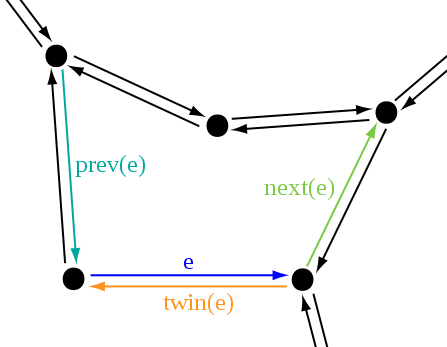
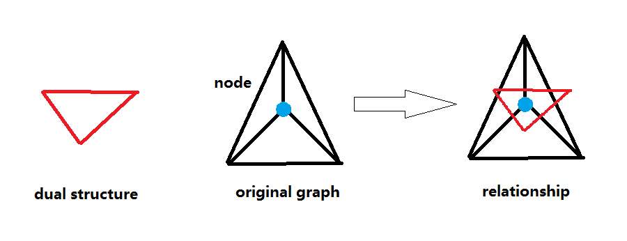
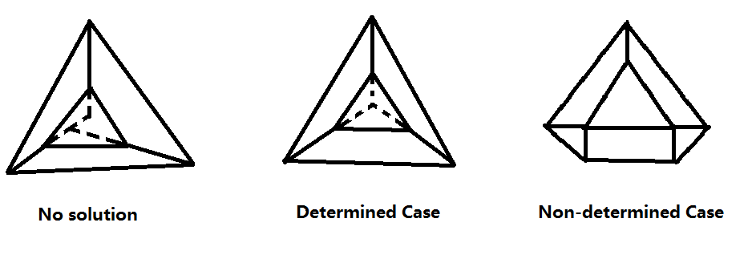
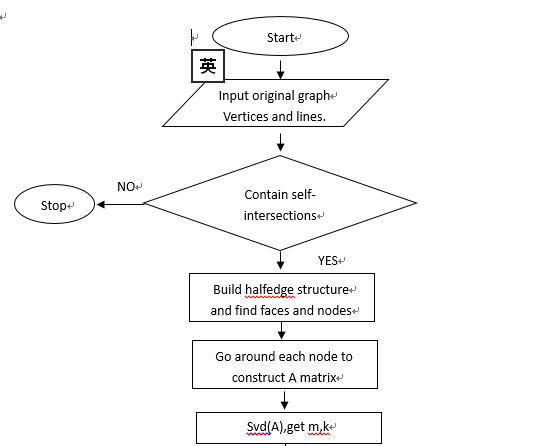
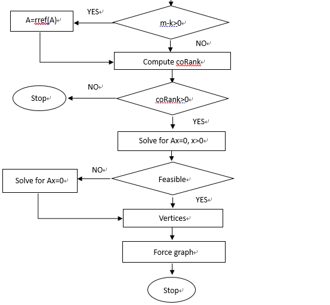

2D Polygon Dual Structure Resolution
======================
This is an online tool to help users to produce the dual structure of a 2D polygon. I developed this tool for Polyhedral Structures Lab of PennDesign. Here is the demo for the tool. 

## Demo

For the video demo, click [here].

## Description.
The dual structure of 2D polygons(or 3D polyhedrons) is widely used in structure mechanics field. In the dual structure, each point corresponds with a face in the original graph. Each edge correspondings with a face pair of the orginal graph and is perpendicular with the edge that the 2 faces share. In this project, when you select one of the element in the dual structure, the corresponding element in the original graph will be highlighted. To solve the vertex positions of the dual structure, I construct a matrix equation based on the topological structure of the original graph.

## Data structure
For the 2D case, I use the half_edge data structure to save the topology relationships between the geometry elements(points, edges and faces). The halfedge data structure can be basically described as the graph below.

More info about halfedge structure can be seen [here](https://www.ics.uci.edu/~dock/manuals/cgal_manual/HalfedgeDS/Chapter_main.html).

In this project, for each halfedge, it also contains the `Perpendicular_hl_ID` member, which points to the halfedge that they are perpendicular to. Similarly,the vertices of the dual structure contain the member of `Force_Face_ID`, which refers to the corresponding faces in the orginal graph and the faces of the original graph contain the member of `Form_Vert_ID`, which refers to the corresponding vertices in the dual structure.

## Algorithm
For each close polygon face in the dual structure, the vectorial sum of all its halfedge is equal to 0. Based on this relationship, we can go through all the face pairs connected to a single node(or vertex) in counterclockwise order(or clockwise order) and build a matrix equation. The matrix equation can be written as:

where x is the solution matrix for the length of all the internal edges of the dual structure and A matrix can be written as something like:

In the A matrix, each column represents the direction of one of the face pairs in the original graph(or one of the edges in the dual structure). Each row reprensents a node in the original graph. The vectorial sum of the internal halfedges in the dual structure that is built around a node in the original graph should equal to 0. 

In this project, we only deal with the graph with no self-intersections. Since we don't want the dual structure to be fliped, we also set the constraints of x>0 for the matrix equation above and use linear programming to get a solution. To to simplify the optimization process of linear programming, we first compute the singular value decomposition(SVD) of the A matrix. If k,the rank of A is less than m,the rows of A, we first echelonize the A matrix and then start the linear programing process.

One thing need to be noticed is that not all the graph can have a dual structure, which means the matrix equation above may only have all 0 solution sometimes. Essentially speaking, it depends on the coRank of the matrix A. The coRank of the A matrix represents the degree of freedom of the corresponding dual structure. If coRank is equal to zero, the matrix equation Ax=0 only has all zero solution, which means that the corresponding dual structure does not exist. If the coRank of the matrix is 1, the corresponding dual structure has only one degree of freedom, which means that the shape of the dual structure is determined and we can only scale it by setting the length value of one of the edges. If the coRank is greater than 1, the shape of corresponding dual structure is not determined and the matrix equation can have multiple solutions.

## Flow Chart
The overall structure of the core algorithm can be described as below:

There is a [publication](http://www.block.arch.ethz.ch/brg/files/2014-cad-vanmele-algebraic-graph-statics_1399184292.pdf) covering more details about how to compute the dual structure. For any question or suggestions, please feel free to contact me.
